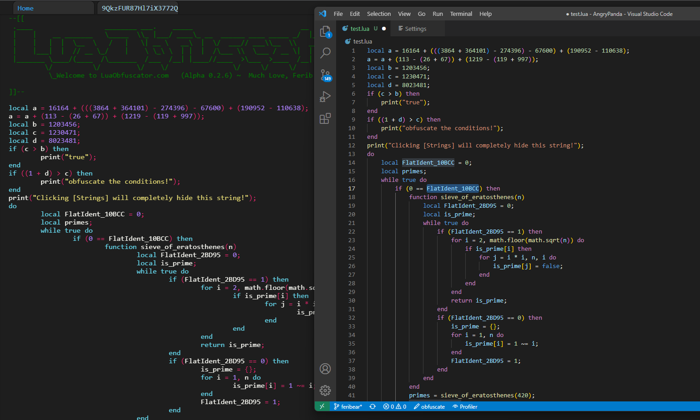
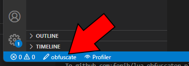
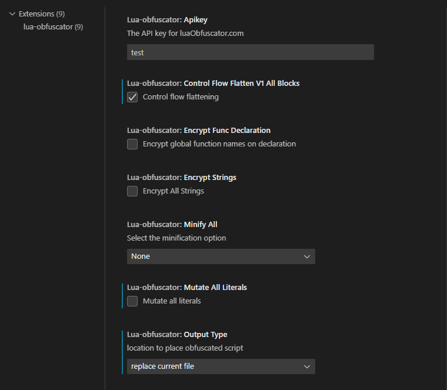

# lua-obfuscator

Minimal vscode extension for easy and simple use of [LuaObfuscator.com](https://luaobfuscator.com/). Offers configurable Lua obfuscation with the click of a button.

## Lua Obfuscator

Achieve an identical level of obfuscation as the website for as long as the input source and configuration are similar. This should help developers get a better understanding of how their code is transformed, allowing them to properly troubleshoot their code, as they can now obtain the correct variable names and line numbers.

# How to Use

Open any `.lua` file and click the button on the bottom of the IDE as seen below.

Before you obfuscate you might want to change the settings.

## Settings

Configure the Obfuscator to your needs. The settings tab can be found at `file` (or `Code` for OSX) -> `preferences` -> `settings` -> `extensions` -> `lua-obfuscator`

> Please note that not all features are supported in this plugin! _(only stable)_

# Credits

- [Ferib](https://github.com/ferib) _(forked to `lua-obfuscator`)_
- [juniorjacob](https://github.com/juniorjacob) _(previous dev, `clvbrew-obf`)_
- [Burkino](https://github.com/Burkino) _(original dev, `clvbrew`)_
