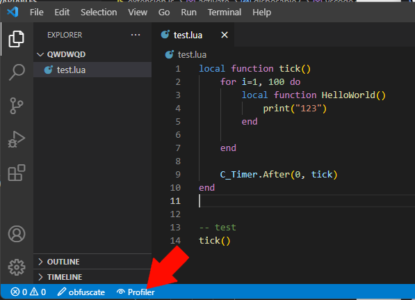
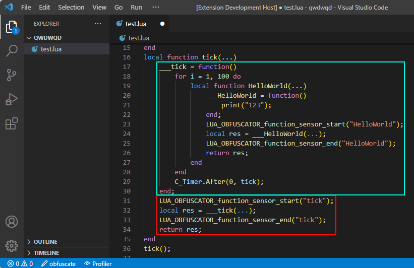

# lua-obfuscator

Minimal vscode extension for easy and simple use of [LuaObfuscator.com](https://luaobfuscator.com/). Offers configurable Lua obfuscation with the click of a button.

## Obfuscator

Obfuscator settings can be found at `file` (or `Code` for OSX) -> `preferences` -> `settings` -> `extensions` -> `lua-obfuscator`

## Wow Profiler

The 'Wow Profiler' is designed to profile performance overhead for World of Warcraft. The profiler injects code around your existing functions to measure the start and end of a function.

To use this feature, simply open any `.lua` file and click the button at the bottom. 

This should use the **online** LuaObfusactor.com and overwrite the existing script with a new one, containing profiling sensors. The image below illustrates where new code is injected in red and existing code is moved in blue.

When done profiling, or when code modifications are needed, you can press the 'Profiler' button once more to undo the bloated code. _(⚠️ please make sure to **undo profiling before closing VSCode** as the original code is cached locally)_

You might also want to look at the [Wow Lua Profiler AddOn](https://github.com/ferib/WowLuaProfiler) to get an in-game GUI.

# Credits

- [Ferib](https://github.com/ferib) _(forked to `lua-obfuscator`)_
- [juniorjacob](https://github.com/juniorjacob) _(previous dev, `clvbrew-obf`)_
- [Burkino](https://github.com/Burkino) _(original dev, `clvbrew`)_
